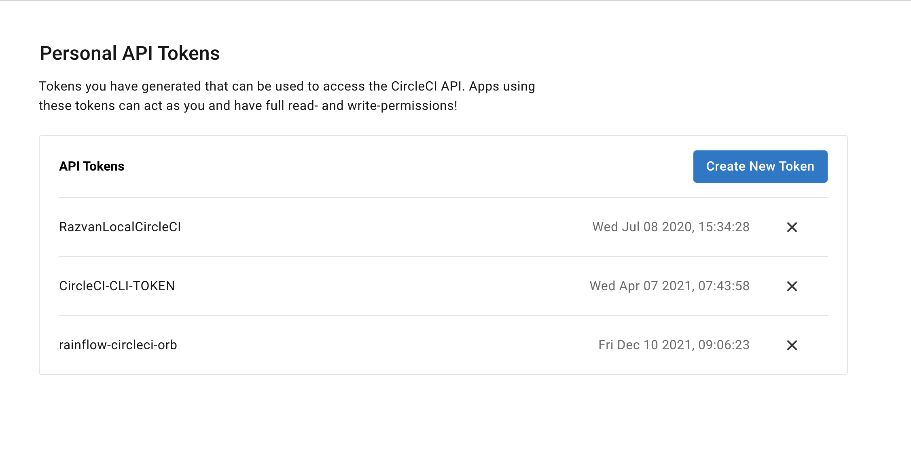
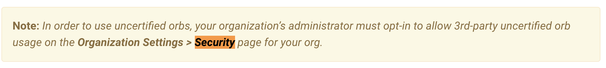
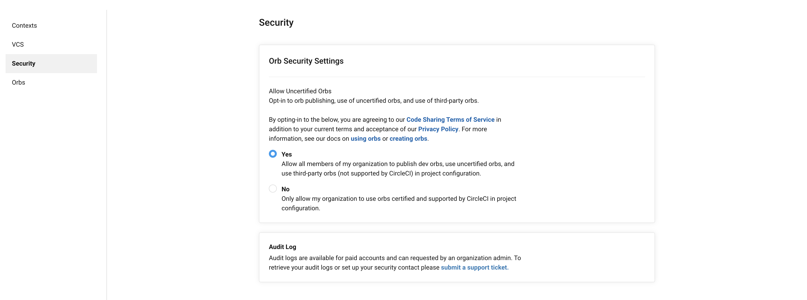

# Railflow CLI CircleCI ORB to easily integrate any testing framework and tools with TestRail.


## Circleci setup

### Create circleci token


Visit: https://app.circleci.com/settings/user/tokens
Create a new personal token


### Prepare CLI to author orbs

#### 1. Install circleci CLI
```
brew install circleci
```

#### 2. Copy .env.sample to .env and replace add the circleci token
```
$ cp .env.sample .env
$ echo "export CIRCLECI_CLI_TOKEN=e23b5346..." > .env
$ source .env
```

### Authoring circleci orbs

### 1. Create a namespace for the organization to host the orb.
**Note**: organization needs to exist in github.com and you need to have permissions to it.
```
$ circleci namespace create railflow-1 github devsekops
```

#### 2. <a name="create">Create a new orb in the namespace</a>
```
$ circleci orb create railflow/railflow-orb
```
Note: If the following issue is encounter:
>Are you sure you wish to create the orb: `railflow/railflow-orb` Yes
>Error: Your organization must enable the 'Uncertified Orbs' feature in org settings to create orbs

 then Organization settings needs to be changed
 
 Navigate to [Circleci Organization Settings https://app.circleci.com/settings/organization/github/**organization**/security](https://app.circleci.com/settings/organization/github/<organization>/security) and enable Uncertified Orbs like in the image
 
 Repeat the process again for <a href="#create">creating a new orb in namespace</a>
 The output of the command should be:
 > Orb `railflow/railflow-orb` created.
Please note that any versions you publish of this orb are world-readable.
You can now register versions of `railflow-1/railflow-1-orb` using `circleci orb publish`.

#### 3. <a name="publish">Publish the orb</a>
 ```
 $ circleci orb publish  promote railflow/railflow-orb@dev:0.0.1 patch
 ```
#### 4. Update orb source code
Edit orb.yml or run_test.sh file to include new functionality and execute [Step 3](#publish)


